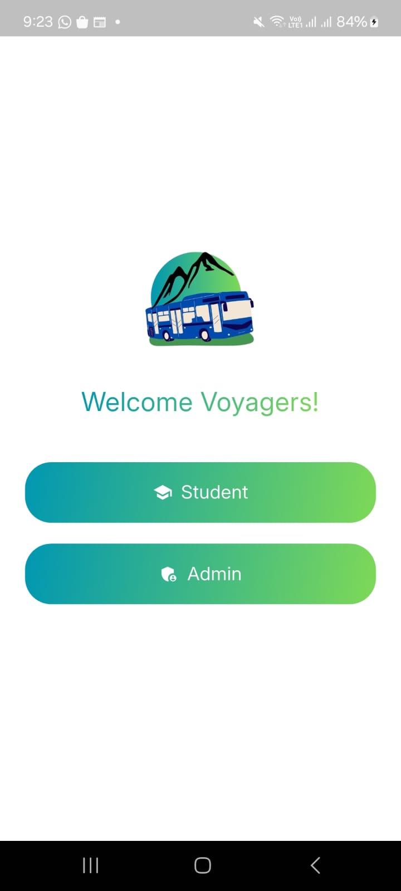
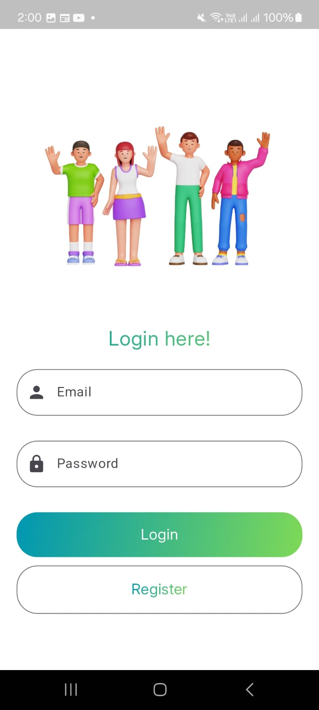
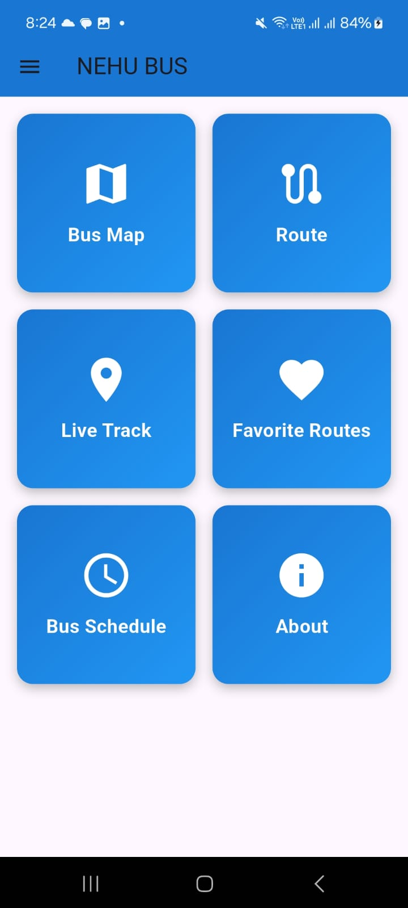
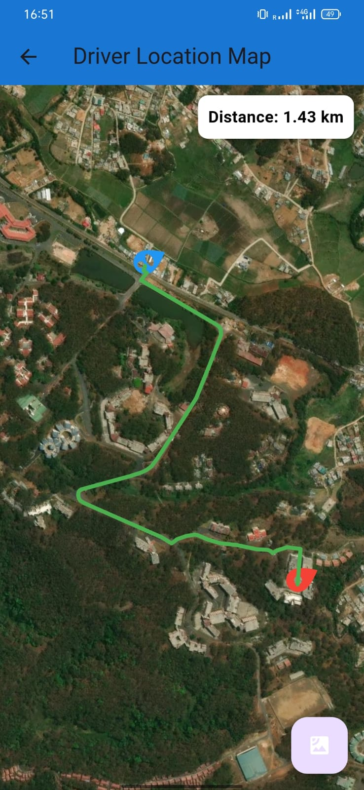
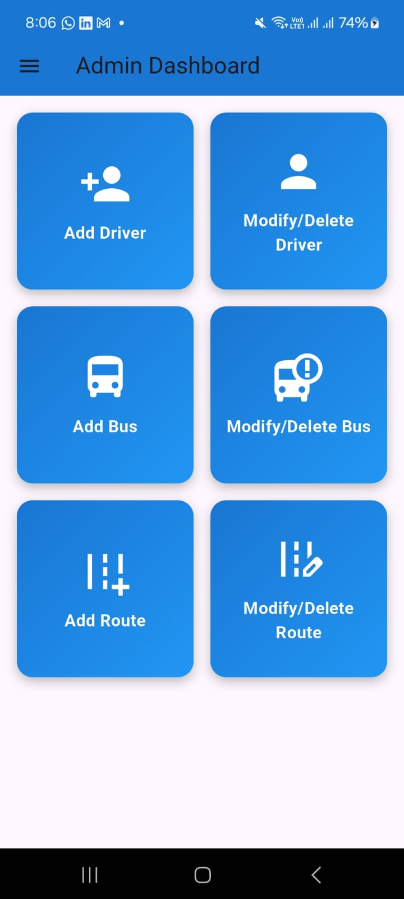
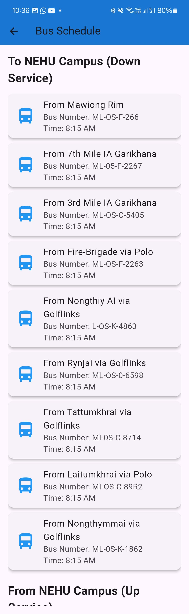
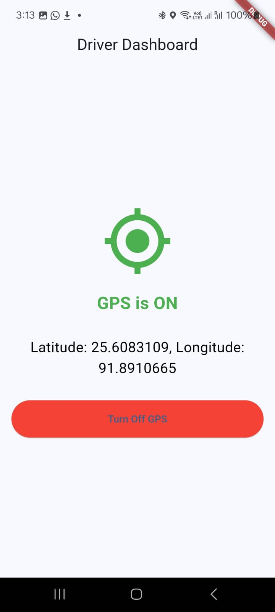
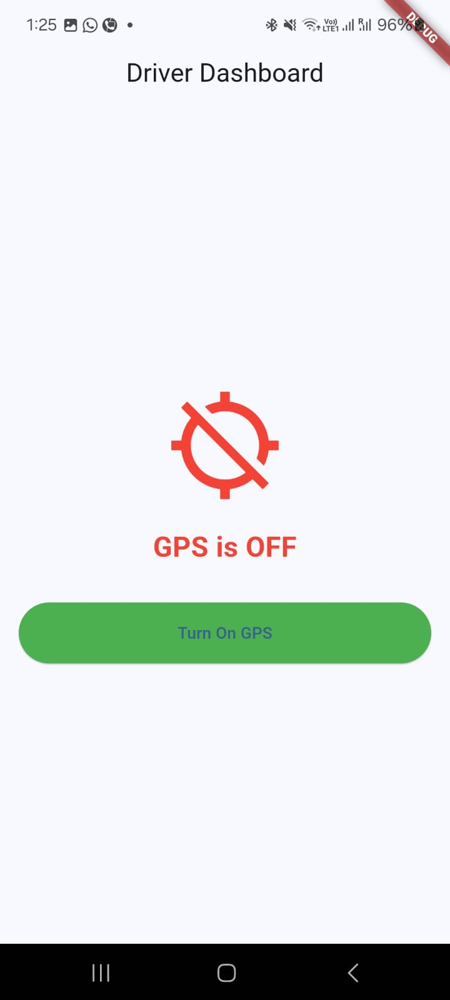
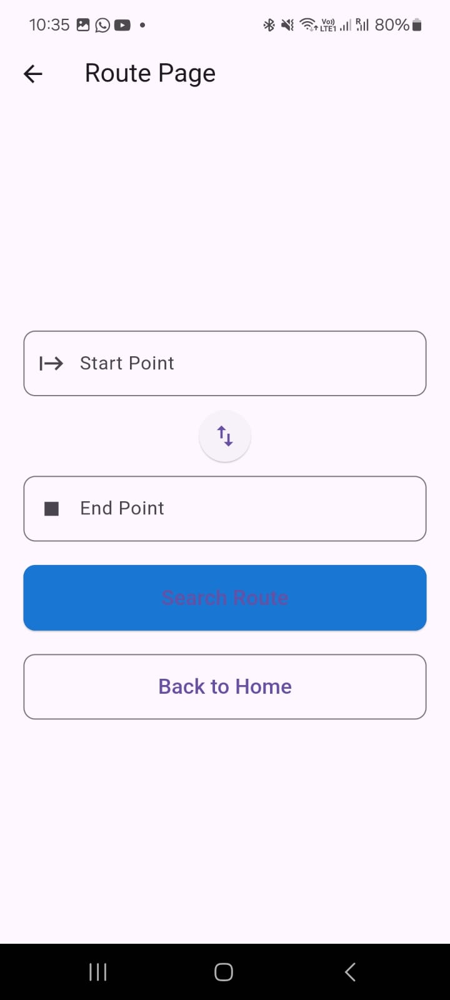

NEHUBUS
A  Real-time fleet tracking system built using Flutter and Firebase Realtime Database. Designed to stream live vehicle coordinates and visualize them on an interactive map.

1.Real-time location updates
2.Firebase-based backend synchronization
3.Role-based authentication
4.Map visualization (OpenMaps / MapTiler)
5.MVC-based architecture

SIMPLE DESIGN
Driver App → Firebase → Student App

TECHNOLOGIES
1.Flutter
2.Dart
3.Firebase Realtime Database
4.REST APIs
5.MapTiler / OpenMaps

